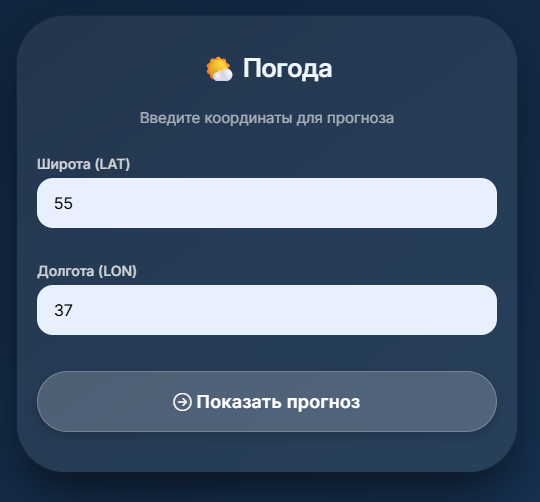
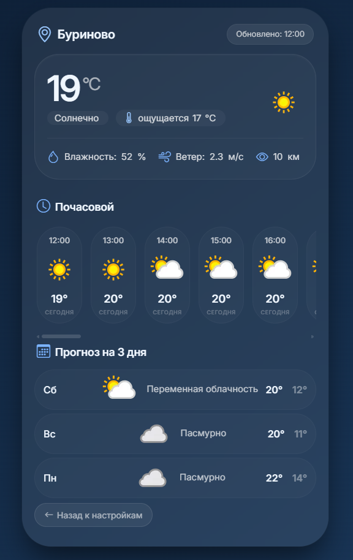

# Weather Monitor

Приложение для мониторинга погоды с использованием WeatherAPI.com.

## 📋 Описание

Weather Monitor — это простое веб-приложение, которое позволяет получать прогноз погоды на основе географических координат. Приложение использует API сервиса WeatherAPI.com для получения актуальных данных о погоде, включая:

- Текущую погоду
- Почасовой прогноз
- Прогноз на 3 дня

## ✨ Особенности

- 🌤️ Отображение текущей погоды с иконками и описанием
- 📊 Почасовой прогноз на текущий день и завтра
- 📅 Прогноз на 3 дня
- 🌡️ Отображение температуры, влажности, скорости ветра и видимости
- 📱 Адаптивный дизайн для мобильных устройств
- 🔄 Валидация входных данных
- 🛡️ Обработка ошибок API

## 🛠️ Технологии

- **PHP 7.4+**
- **cURL** — для HTTP-запросов к API
- **Valitron** — для валидации данных
- **PHP dotenv** — для управления переменными окружения
- **Bootstrap 5** — для стилизации интерфейса
- **Bootstrap Icons** — для иконок

## 📦 Установка

### 1. Клонирование репозитория

```bash
git clone https://github.com/Alexander-Yurtaev/WeatherMonitor.PHP.git
cd WeatherMonitor.PHP
```

### 2. Установка зависимостей

```bash
php composer.phar install
```

### 3. Настройка переменных окружения

Создайте файл `.env` в корневой директории проекта на основе `.env.example`:

```bash
cp .env.example .env
```

Отредактируйте файл `.env` и добавьте ваш API-ключ:

```
WEATHER_API_KEY=your_api_key_here
```

### 4. Получение API-ключа

Для работы приложения необходим API-ключ сервиса WeatherAPI.com:
1. Перейдите на [WeatherAPI.com](https://www.weatherapi.com/)
2. Зарегистрируйтесь и получите бесплатный API-ключ
3. Добавьте полученный ключ в файл `.env`

## 🚀 Использование

### Запуск приложения

Для запуска приложения используйте встроенный PHP-сервер:

```bash
php -S localhost:8000
```

Затем откройте в браузере: `http://localhost:8000`

### Использование

1. Введите **широту (LAT)** — например: `55.7558`
2. Введите **долготу (LON)** — например: `37.6173`
3. Нажмите кнопку **"Показать прогноз"**
4. Просмотрите прогноз погоды для указанных координат

## 📁 Структура проекта

```
weather_monitor/
├── src/
│   ├── Downloader.php    # Класс для загрузки данных через cURL
│   └── Utils.php         # Вспомогательные функции
├── incs/
│   ├── header.tpl.php    # Шапка страницы
│   └── footer.tpl.php    # Подвал страницы
├── config/
│   └── cacert.pem        # SSL-сертификат для cURL
├── index.php              # Главная страница (форма ввода координат)
├── weather.php            # Страница с прогнозом погоды
├── composer.json          # Конфигурация Composer
├── .env.example           # Пример файла с переменными окружения
└── README.md              # Этот файл
```

## 🔧 Классы и методы

### Downloader

Класс для выполнения HTTP-запросов к API.

```php
$downloader = new WeatherMonitor\Downloader();
$data = $downloader->load($url);
```

### Utils

Набор статических вспомогательных методов:

| Метод | Описание |
|-------|----------|
| `GetTimeFromDate()` | Извлекает время из строки даты |
| `GetNumber()` | Преобразует строку в число с округлением |
| `GetImageTag()` | Генерирует HTML-тег изображения |
| `ConvertKmH2Ms()` | Конвертирует км/ч в м/с |
| `GetValueFromEnv()` | Получает значение из переменных окружения |
| `GetHour()` | Извлекает час из даты |
| `GetWeekdayName()` | Возвращает название дня недели на русском |

## ⚙️ Требования

- PHP 7.4 или выше
- Расширение cURL
- Расширение bcmath
- Composer

## 🐛 Обработка ошибок

Приложение корректно обрабатывает следующие ошибки:
- Отсутствие API-ключа
- Проблемы с подключением к API
- Неверный формат координат
- Отсутствие данных по указанным координатам

## 📝 Лицензия

MIT

## 👨‍💻 Автор

**Alexander Yurtaev**
- Email: ayurtaev@mail.ru

## 🙏 Благодарности

- [WeatherAPI.com](https://www.weatherapi.com/) за предоставление API для погоды
- [Valitron](https://github.com/vlucas/valitron) за библиотеку валидации
- [PHP dotenv](https://github.com/vlucas/phpdotenv) за управление переменными окружения

## Скриншоты

<p>
    <em style="display: block; text-align: center;">Настройки</em>
    <div style="display: flex; gap: 20px; justify-content: center; flex-wrap: wrap;">
      <div style="flex: 1; min-width: 300px; max-width: 700px;">
        
      </div>
    </div>
</p>

<p>
    <em style="display: block; text-align: center;">Главное окно</em>
    <div style="display: flex; gap: 20px; justify-content: center; flex-wrap: wrap;">
      <div style="flex: 1; min-width: 300px; max-width: 700px;">
        
      </div>
    </div>
</p>